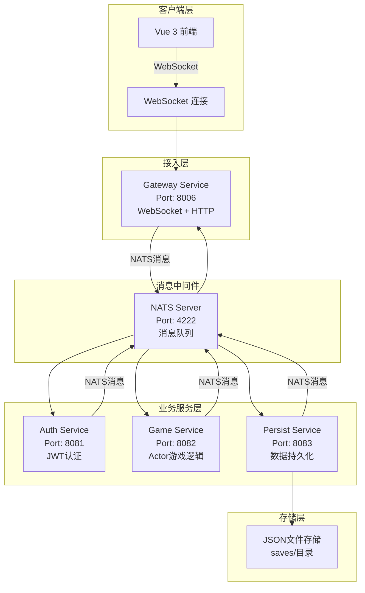
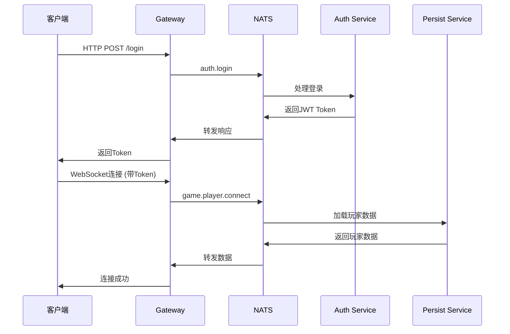
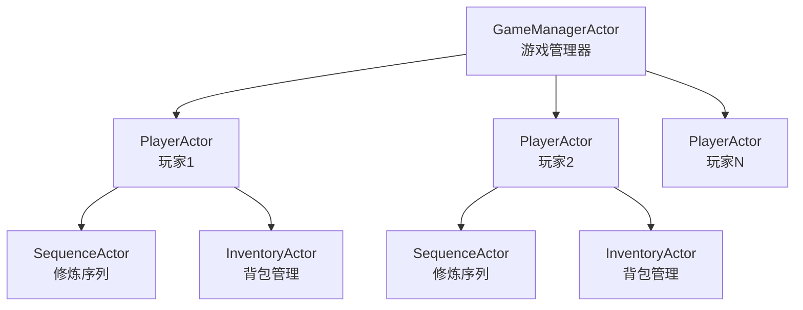
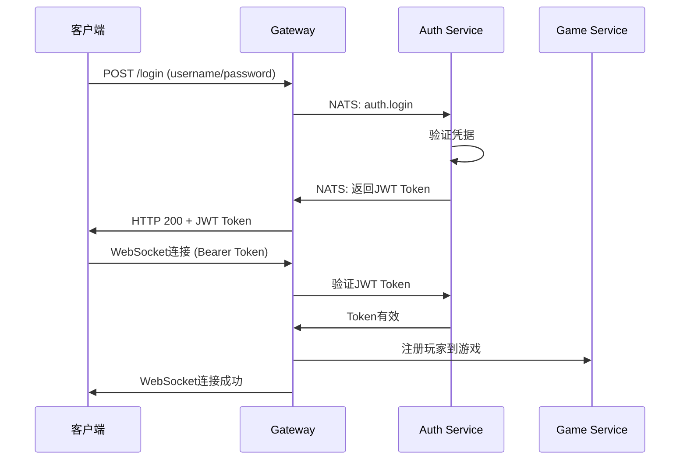

# 🏗️ Idle Server 技术架构文档

## 📋 架构概述

Idle Server 是一款基于 **微服务架构 + NATS消息队列 + Actor模型** 的修仙放置MMORPG后端系统。项目采用现代化的分布式架构设计，实现了高并发、高可扩展性和高可维护性的游戏服务端。

### 🎯 核心设计理念

- **微服务架构**: 按业务功能拆分为独立服务
- **消息驱动**: 通过NATS实现服务间异步通信
- **Actor模型**: 在游戏服务中使用Actor保证并发安全
- **统一架构**: 所有服务使用统一的NATS处理框架

---

## 🧩 系统架构图



---

## 🎮 微服务组件详解

### 🌐 Gateway Service (端口: 8006)

**职责**: 客户端接入、WebSocket管理、消息路由

**核心功能**:
- WebSocket连接管理和升级
- HTTP身份验证端点 (login/register)
- 消息路由和转发
- 客户端状态管理
- CORS跨域支持

**技术栈**:
- Gin (HTTP框架)
- Gorilla/WebSocket
- NATS Manager (统一消息处理)

**关键文件**:
- `internal/gate/service.go` - 服务主逻辑
- `internal/gate/connection.go` - WebSocket连接处理
- `internal/gate/nats_handler.go` - NATS消息处理

### 🔐 Auth Service (端口: 8081)

**职责**: 用户认证、JWT令牌管理、用户数据管理

**核心功能**:
- 用户注册和登录
- JWT令牌生成和验证
- 密码加密和验证
- 用户数据持久化
- NATS消息处理

**技术栈**:
- JWT认证
- bcrypt密码加密
- NATS Manager
- GORM (数据库ORM)

**关键文件**:
- `internal/auth/service.go` - 认证服务主逻辑
- `internal/auth/nats_handler.go` - NATS消息处理

### 🎮 Game Service (端口: 8082)

**职责**: 游戏核心逻辑、Actor系统、实时状态管理

**核心功能**:
- Actor模型实现 (PlayerActor, GameManagerActor)
- 修炼序列逻辑处理
- 装备和物品系统
- 实时游戏状态计算
- NATS消息通信

**技术栈**:
- protoactor-go (Actor框架)
- 游戏领域逻辑 (DDD)
- NATS Manager

**关键文件**:
- `internal/game/service.go` - 游戏服务主逻辑
- Actor实现 (在规划中)

### 💾 Persist Service (端口: 8083)

**职责**: 数据持久化、存储管理、缓存策略

**核心功能**:
- 异步数据保存
- 玩家数据加载
- JSON文件存储管理
- 数据库迁移 (GORM)
- Redis缓存支持

**技术栈**:
- GORM (ORM框架)
- Redis (缓存)
- NATS Manager
- MySQL/PostgreSQL支持

**关键文件**:
- `internal/persist/service.go` - 持久化服务主逻辑
- `common/database/` - 数据库抽象层

---

## 📡 NATS消息通信架构

### 🎯 消息主题设计

```go
// 认证服务主题
const (
    AuthLoginSubject        = "auth.login"
    AuthRegisterSubject     = "auth.register"
    AuthGetUserSubject      = "auth.get_user"
)

// 游戏服务主题
const (
    GamePlayerConnectSubject    = "game.player.connect"
    GamePlayerDisconnectSubject = "game.player.disconnect"
    GameStateSubject            = "game.state"
)

// 持久化服务主题
const (
    PersistSaveUserSubject     = "persist.save_user"
    PersistLoadUserSubject     = "persist.load_user"
    PersistSavePlayerSubject   = "persist.save_player"
    PersistLoadPlayerSubject   = "persist.load_player"
)

// 网关广播主题
const (
    GatewayBroadcastSubject = "gateway.broadcast"
)
```

### 🔄 消息流程示例



---

## 🎭 Actor模型设计

### 🎯 Game Service Actor架构



### 🔄 Actor消息处理

```go
// 消息类型定义
type MessageFromWS struct {
    PlayerID string
    Data     []byte
}

type MsgClientPayload struct {
    Type string      `json:"type"`
    Data interface{} `json:"data"`
}

// Actor处理流程
func (p *PlayerActor) Receive(ctx actor.Context) {
    switch msg := ctx.Message().(type) {
    case *MessageFromWS:
        // 处理WebSocket消息
        p.handleClientMessage(msg)
    case *MsgSavePlayer:
        // 处理保存请求
        p.handleSavePlayer(msg)
    case *MsgSequenceResult:
        // 处理修炼结果
        p.handleSequenceResult(msg)
    }
}
```

---

## 🗂️ 数据存储架构

### 💾 存储层次设计

```
存储层
├── 主存储: MySQL数据库 (已实现)
│   ├── users                 # 用户认证信息表
│   ├── players               # 玩家基础信息表
│   └── game_progress         # 游戏进度数据表
├── 缓存层: Redis (已实现)
│   ├── player:data:{id}      # 玩家数据缓存
│   ├── online:players        # 在线玩家集合
│   ├── ranking:{type}        # 排行榜数据
│   └── user:session:{id}     # 用户会话缓存
└── 数据备份:
    ├── MySQL定期备份
    └── Redis持久化配置
```

### 📊 数据模型

#### MySQL 表结构

**users 表** - 用户认证信息
```sql
CREATE TABLE users (
    id BIGINT PRIMARY KEY AUTO_INCREMENT,
    username VARCHAR(50) UNIQUE NOT NULL,
    password_hash VARCHAR(255) NOT NULL,
    player_id VARCHAR(64) UNIQUE NOT NULL,
    created_at TIMESTAMP DEFAULT CURRENT_TIMESTAMP,
    updated_at TIMESTAMP DEFAULT CURRENT_TIMESTAMP ON UPDATE CURRENT_TIMESTAMP,
    last_login TIMESTAMP NULL,
    is_active BOOLEAN DEFAULT TRUE
);
```

**players 表** - 玩家基础信息
```sql
CREATE TABLE players (
    id BIGINT PRIMARY KEY AUTO_INCREMENT,
    player_id VARCHAR(64) UNIQUE NOT NULL,
    username VARCHAR(50) NOT NULL,
    level INT DEFAULT 1,
    exp BIGINT DEFAULT 0,
    created_at TIMESTAMP DEFAULT CURRENT_TIMESTAMP,
    updated_at TIMESTAMP DEFAULT CURRENT_TIMESTAMP ON UPDATE CURRENT_TIMESTAMP,
    last_save_time TIMESTAMP DEFAULT CURRENT_TIMESTAMP,
    is_online BOOLEAN DEFAULT FALSE,
    game_data JSON DEFAULT '{}',
    total_playtime BIGINT DEFAULT 0,
    login_count INT DEFAULT 0
);
```

**game_progress 表** - 游戏进度数据
```sql
CREATE TABLE game_progress (
    id BIGINT PRIMARY KEY AUTO_INCREMENT,
    player_id VARCHAR(64) NOT NULL,
    progress_type VARCHAR(50) NOT NULL,
    progress_key VARCHAR(100) NOT NULL,
    progress_value JSON NOT NULL,
    created_at TIMESTAMP DEFAULT CURRENT_TIMESTAMP,
    updated_at TIMESTAMP DEFAULT CURRENT_TIMESTAMP ON UPDATE CURRENT_TIMESTAMP,
    UNIQUE KEY unique_progress (player_id, progress_type, progress_key)
);
```

#### Go 数据结构

```go
// UserData 用户数据
type UserData struct {
    Username  string    `json:"username"`
    PlayerID  string    `json:"player_id"`
    CreatedAt time.Time `json:"created_at"`
    LastLogin time.Time `json:"last_login"`
}

// PlayerData 玩家数据
type PlayerData struct {
    PlayerID     string                 `json:"player_id"`
    Username     string                 `json:"username"`
    Level        int                    `json:"level"`
    Exp          int64                  `json:"exp"`
    SequenceLevels map[string]int      `json:"sequence_levels"`
    Inventory    map[string]int         `json:"inventory"`
    Equipment    map[string]string      `json:"equipment"`
    LastSaveTime time.Time              `json:"last_save_time"`
}
```

---

## ⚙️ 配置管理

### 🔧 服务配置

```go
// common/constants.go
const (
    // 服务端口
    GatewayServicePort = 8006
    AuthServicePort    = 8081
    GameServicePort    = 8082
    PersistServicePort = 8083

    // NATS配置
    NATSURL = "nats://localhost:4222"

    // 存储配置
    SaveDir = "saves/"
)
```

### 📝 配置文件

```json
// 游戏配置示例
{
  "sequences": {
    "meditation": {
      "name": "打坐修炼",
      "base_interval": 5,
      "base_exp": 10,
      "rewards": [...]
    }
  },
  "equipment": {...},
  "items": {...}
}
```

---

## 🚀 部署架构

### 📦 服务启动顺序

```bash
# 1. 启动NATS Server
nats-server -p 4222

# 2. 启动核心服务
cd idlemmoserver/auth && go run main.go &
cd idlemmoserver/persist && go run main.go &
cd idlemmoserver/game && go run main.go &
cd idlemmoserver/gateway && go run main.go &

# 3. 启动前端
cd idle-vue && npm run dev
```

### 🌐 访问端点

| 服务 | 地址 | 功能 |
|------|------|------|
| 前端界面 | http://localhost:5173 | Vue前端应用 |
| API网关 | http://localhost:8006 | HTTP API接口 |
| WebSocket | ws://localhost:8006/ws | WebSocket连接 |
| 健康检查 | http://localhost:8006/health | 服务健康状态 |
| 调试信息 | http://localhost:8006/debug | 连接调试信息 |

---

## 🛡️ 安全架构

### 🔐 认证授权流程



### 🔒 安全特性

- **JWT认证**: 无状态的身份验证
- **密码加密**: bcrypt哈希加密
- **CORS保护**: 跨域请求控制
- **Token过期**: 自动会话管理

---

## 📈 性能优化

### ⚡ 高并发设计

1. **Actor模型**: 无锁并发，避免竞态条件
2. **异步处理**: NATS异步消息，非阻塞I/O
3. **连接池**: 数据库连接复用
4. **缓存策略**: Redis缓存热点数据

### 📊 监控指标

```go
// 性能指标
type Metrics struct {
    ActiveConnections int     `json:"active_connections"`
    MessagesPerSecond float64 `json:"messages_per_second"`
    ResponseTime      int     `json:"response_time_ms"`
    MemoryUsage      int64   `json:"memory_usage_mb"`
}
```

---

## 🔧 开发工具

### 🛠️ 开发环境

- **Go 1.21+**: 后端开发语言
- **Node.js 18+**: 前端开发环境
- **NATS Server**: 消息中间件
- **Redis**: 缓存服务 (可选)

### 📋 常用命令

```bash
# 依赖管理
go mod tidy

# 服务启动
./scripts/start_simplified.sh  # Linux/macOS
./scripts/start_simplified.bat # Windows

# 构建服务
./scripts/build_all.sh

# 停止服务
./scripts/stop_all.sh
```

---

## 🎯 架构优势

### ✅ 技术优势

1. **微服务独立性**: 服务独立开发、部署、扩展
2. **消息驱动**: 松耦合、高内聚的架构设计
3. **Actor并发**: 自然的并发安全保证
4. **统一框架**: 简化开发和维护复杂度
5. **可扩展性**: 支持水平扩展和负载均衡

### 🚀 业务优势

1. **高可用性**: 服务隔离，单点故障不影响整体
2. **开发效率**: 模块化开发，团队协作友好
3. **维护性**: 清晰的服务边界和职责划分
4. **监控友好**: 独立的服务日志和指标
5. **技术栈灵活**: 不同服务可采用最优技术方案

---

## 🔮 未来演进规划

### 短期优化 (1-3个月)
- [ ] 完善Game Service的Actor实现
- [ ] 添加Redis缓存层
- [ ] 实现服务健康检查
- [ ] 完善错误处理和重试机制

### 中期扩展 (3-6个月)
- [ ] 数据库迁移到PostgreSQL
- [ ] 添加服务监控和日志系统
- [ ] 实现负载均衡和服务发现
- [ ] 添加API文档和测试用例

### 长期规划 (6-12个月)
- [ ] 容器化部署 (Docker + Kubernetes)
- [ ] 分布式追踪和监控
- [ ] 服务网格架构
- [ ] 多区域部署支持

---

## 📚 相关文档

- **[README.md](./README.md)**: 项目概述和快速开始
- **[CLAUDE.md](./CLAUDE.md)**: 开发指导和规范
- **[API文档](./docs/api.md)**: API接口文档 (规划中)
- **[部署指南](./docs/deployment.md)**: 生产环境部署指南 (规划中)

---

*文档版本: v1.0.0*
*最后更新: 2025-10-28*
*架构状态: 已实现并运行中*