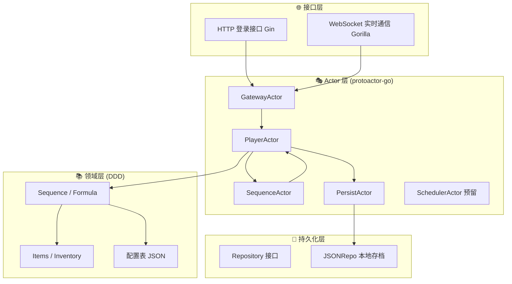
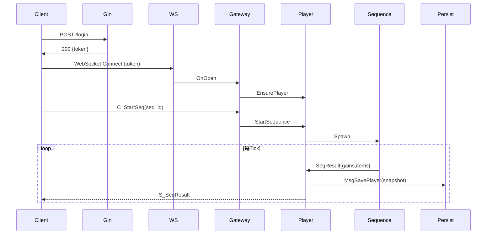

# 🧱 IdleMMO Server (修仙放置 MMORPG 服务端)

> 一款以东方玄幻修仙为题材的放置类 MMORPG 服务端  
> 使用 **Go + Gin + Gorilla/WebSocket + protoactor-go** 构建，  
> 采用 **纯 Actor 驱动 + DDD（领域驱动设计）** 架构。

---

## 🎮 游戏设计概述

### 🧘‍♂️ 游戏核心循环

玩家是一名修仙者，能选择不同的“**修炼序列（Sequence）**”进行挂机修炼。  
每个序列代表修仙生活中的一类活动，例如：

- 🌿 **采集灵草**
- ⛏️ **开采灵矿**
- 🔥 **炼丹炼器**
- 🧘 **打坐修炼**
- 🕹️ **探索秘境 / 云游四方**

每个序列：
- 按固定时间间隔进行结算；
- 有产出、稀有掉落与奇遇；
- 拥有独立等级与经验成长；
- 可在启动前配置增益品、消耗品；
- 玩家可随时切换当前序列。

未来目标是形成一个 **以“修炼序列”为核心循环** 的 MMORPG 放置生态。

---

## 🎯 项目目标

| 阶段 | 目标 | 说明 |
|------|------|------|
| **Phase 1** | ✅ 单人挂机循环闭环 | 登录 → 修炼 → 掉落 → 装备 → 背包 → 存盘 |
| **Phase 2** | 🔄 深度成长系统 | 子项目、成就、物品使用、序列强化 |
| **Phase 3** | 🤝 多人系统 | 组队、交易行、排行榜、世界事件 |
| **Phase 4** | ☁️ 分布式架构 | 使用 protoactor-go cluster 分片部署 |
| **Phase 5** | 🌍 LiveOps 服务器 | 支持活动、限时奇遇、世界进度 |

---

## ⚙️ 技术架构概览

### 🧩 架构分层



---

## 🧠 核心设计理念

| 概念 | 说明 |
|------|------|
| **Actor 驱动** | 所有逻辑封装为独立 Actor，无锁、并发安全。 |
| **领域建模 (DDD)** | 将业务逻辑抽象为领域对象：`Sequence`, `Formula`, `Item`, `Inventory`。 |
| **纯消息通信** | 组件间只通过消息交互，不共享内存。 |
| **异步持久化** | 持久化通过 `PersistActor` 异步处理，避免阻塞游戏逻辑。 |
| **表驱动** | 所有修炼、掉落、奇遇数据由 JSON 配置表驱动。 |

---

## 🧩 当前项目结构

```
idlemmoserver/
├── cmd/server/main.go              # 启动入口
├── internal/
│   ├── app/                        # 预留应用层
│   ├── gateway/                    # HTTP + WebSocket 层
│   ├── actors/                     # Actor 层 (核心逻辑)
│   ├── domain/                     # 领域层 (Sequence / Items / Inventory)
│   └── persist/                    # 持久化层 (Repository / JSONRepo)
└── saves/                          # 本地 JSON 存档
```

---

## 🔄 当前阶段进度（Phase 1）

✅ **已完成功能：**
- [x] HTTP 登录接口（Gin）
- [x] WebSocket 通信（Gorilla）
- [x] 玩家 Actor 生命周期
- [x] SequenceActor：修炼逻辑 + 掉落 + 奇遇
- [x] SchedulerActor：统一时间调度系统
- [x] Domain 层：Sequence / Formula / Items / Equipment
- [x] 修炼序列等级和进度系统
- [x] 装备系统：掉落、装备、属性加成
- [x] Inventory 背包系统
- [x] PersistActor 异步存盘
- [x] JSONRepo 文件持久化
- [x] CORS 跨域支持（支持前端 Vue 访问）

---

## ⚡ 系统运行流程



---

## 📦 当前存档示例

`saves/player_michael.json`
```json
{
  "PlayerID": "michael",
  "SeqLevels": {"meditation": 2},
  "Inventory": {"herb_spirit": 4, "ore_iron": 5},
  "Exp": 180
}
```

---

## 🚀 下一阶段计划

| 模块 | 内容 | 状态 |
|------|------|------|
| 🔮 子项目系统 | 序列分支选择、解锁条件 | 🚧 设计中 |
| 🎯 成就系统 | 修炼里程碑、特殊奖励 | 🚧 规划中 |
| 💬 物品使用系统 | 消耗品使用、临时增益 | 🚧 待添加 |
| 🌐 多人功能 | 组队修炼、交易行、排行榜 | 🧱 预研阶段 |
| ☁️ Cluster 支持 | protoactor-go/cluster 分布式部署 | 🧱 未来目标 |

---

## 💡 开发约定

- 所有 Actor 间通信通过 **protoactor-go 消息传递**；
- Actor **单线程执行逻辑**；
- 所有存取由 `PersistActor` 统一负责；
- 所有逻辑表可在 `/internal/domain/config.json` 配置；
- Player 数据在每次 Tick 后自动异步保存。

---

## 🧩 开发环境要求

| 组件 | 版本 |
|------|------|
| Go | ≥ 1.21 |
| Gin | latest |
| Gorilla/WebSocket | latest |
| Proto.Actor-Go | latest |

---

## 🧠 作者注记

> 本项目旨在构建一个可扩展的放置类修仙游戏服务端框架，  
> 以 **Actor 模型 + DDD** 为核心理念，探索并发安全与高扩展性在游戏后端中的最佳实践。
>
> 未来目标是实现一个可持续进化的世界，  
> 玩家修炼、组队、交易、突破境界，  
> 每一个行为都被驱动于 Actor 的消息流之中。

---

## 📜 License
MIT License © 2025 Michael