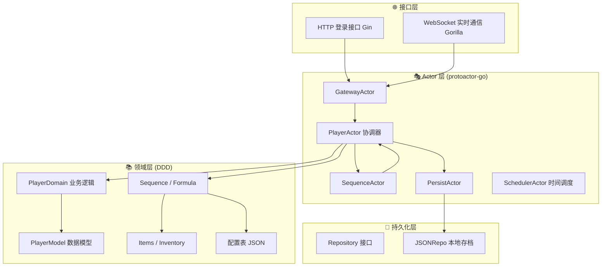
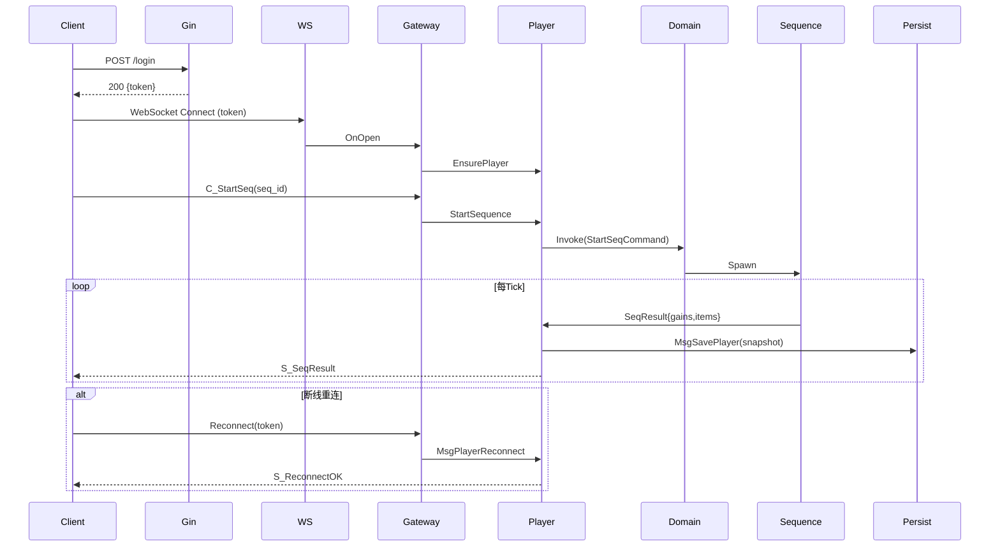

# 🧱 IdleMMO Server (修仙放置 MMORPG 服务端)

> 一款以东方玄幻修仙为题材的放置类 MMORPG 服务端  
> 使用 **Go + Gin + Gorilla/WebSocket + protoactor-go** 构建，  
> 采用 **纯 Actor 驱动 + DDD（领域驱动设计）** 架构。

---

## 🎮 游戏设计概述

### 🧘‍♂️ 游戏核心循环

玩家是一名修仙者，能选择不同的“**修炼序列（Sequence）**”进行挂机修炼。  
每个序列代表修仙生活中的一类活动，例如：

- 🌿 **采集灵草**：定时采集基础材料，产出灵草类道具。
- ⛏️ **开采灵矿**：随机产出灵矿、宝石与矿脉奇遇。
- 🔥 **炼丹炼器**：消耗灵草与灵矿，产出高阶丹药或装备。
- 🧘 **打坐修炼**：提升修为与经验，可能触发心境突破。
- 🕹️ **探索秘境 / 云游四方**：高风险高收益，触发奇遇或稀有掉落。

每个修炼序列具备以下特点：
- 按固定时间间隔进行结算；
- 产出基础与稀有资源；
- 可能触发奇遇或事件；
- 拥有独立等级与经验成长；
- 可在启动前配置增益品、消耗品；
- 玩家可随时切换当前序列。

> 💡 未来目标是形成一个以“修炼序列”为核心循环的放置类 MMORPG 世界。

---

## 🎯 项目目标

| 阶段 | 目标 | 说明 |
|------|------|------|
| **Phase 1** | ✅ 单人挂机循环闭环 | 登录 → 修炼 → 掉落 → 装备 → 背包 → 存盘 |
| **Phase 1.5** | 🔧 架构重构 (DDD + Command) | PlayerActor → Domain + Command 分层 |
| **Phase 2** | 🔄 深度成长系统 | 子项目、成就、物品使用、序列强化 |
| **Phase 3** | 🤝 多人系统 | 组队、交易行、排行榜、世界事件 |
| **Phase 4** | ☁️ 分布式架构 | protoactor-go cluster 分片部署 |
| **Phase 5** | 🌍 LiveOps 服务器 | 活动系统 / 世界事件 / 限时奇遇 |

---

## ⚙️ 技术架构概览

### 🧩 架构分层



---

## 🧠 核心设计理念

| 概念 | 说明 |
|------|------|
| **Actor 驱动** | 所有逻辑封装为独立 Actor，无锁并发，天然安全。 |
| **领域建模 (DDD)** | 将业务逻辑抽象为领域对象：`Sequence`, `Item`, `Inventory`, `PlayerModel`。 |
| **纯消息通信** | Actor 之间仅通过消息交互，不共享状态。 |
| **异步持久化** | 由 `PersistActor` 异步保存数据，避免阻塞逻辑。 |
| **表驱动** | 所有修炼、掉落、奇遇数据由 JSON 配置表驱动。 |

---

## 🧩 当前项目结构

```
idlemmoserver/
├── cmd/server/main.go              # 启动入口
├── internal/
│   ├── app/                        # 应用层（预留）
│   ├── gateway/                    # HTTP + WebSocket 层
│   ├── actors/                     # Actor 层 (核心逻辑)
│   │   ├── messages.go             # 消息定义
│   │   ├── player/                 # 玩家模块（重构中）
│   │   │   ├── player_actor.go     # 协调器 Actor
│   │   │   ├── player_domain.go    # 业务逻辑服务
│   │   │   ├── player_model.go     # 玩家数据模型
│   │   │   ├── command_handler.go  # 命令调度中心
│   │   │   └── commands/           # 各种具体命令实现
│   ├── domain/                     # 通用领域模型 (Items / Sequence / Inventory)
│   └── persist/                    # 持久化层 (Repository / JSONRepo)
└── saves/                          # 本地 JSON 存档
```

---

## ⚡ 系统运行流程



---

## 📦 存档示例

`saves/player_michael.json`
```json
{
  "PlayerID": "michael",
  "SeqLevels": {"meditation": 2},
  "Inventory": {"herb_spirit": 4, "ore_iron": 5},
  "Exp": 180
}
```

---

## 🚀 当前进度与计划

### ✅ **已完成功能（Phase 1）**
- [x] HTTP 登录接口（Gin）
- [x] WebSocket 通信（Gorilla）
- [x] 玩家 Actor 生命周期
- [x] SequenceActor：修炼逻辑 + 掉落 + 奇遇
- [x] SchedulerActor：统一时间调度系统
- [x] Domain 层：Sequence / Formula / Items / Equipment
- [x] 修炼序列等级与进度系统
- [x] 装备系统：掉落、装备、属性加成
- [x] Inventory 背包系统
- [x] PersistActor 异步存盘
- [x] JSONRepo 文件持久化
- [x] CORS 跨域支持（前端 Vue 可访问）

---

### 🔧 **架构重构阶段（Phase 1.5）**
| 模块 | 内容 | 状态 |
|------|------|------|
| 🧩 **PlayerModel** | 纯数据模型，存储玩家状态 | ✅ 已实现 |
| ⚙️ **PlayerDomain** | 领域服务层，封装游戏逻辑 | 🚧 开发中 |
| 🧠 **Command 模式** | 解耦操作与执行，支持扩展 | 🚧 设计中 |
| 🎭 **轻量 PlayerActor** | 职责精简，仅做消息协调 | 🚧 实施中 |
| 🧱 **CommandHandler** | 统一命令注册与调度 | 🚧 实施中 |

---

### 🔮 **未来阶段**
| 阶段 | 内容 |
|------|------|
| **Phase 2** | 子项目系统 / 成就系统 / 道具使用 |
| **Phase 3** | 多人联机 / 组队修炼 / 交易行 |
| **Phase 4** | Proto.Actor Cluster 分布式部署 |
| **Phase 5** | 世界进度 / LiveOps 动态活动 |

---

## 💡 开发约定

- 所有 Actor 间通信通过 **protoactor-go 消息传递**；
- Actor **单线程执行逻辑**；
- 所有存取由 `PersistActor` 统一负责；
- 所有逻辑表在 `/internal/domain/config.json` 中配置；
- 玩家数据每个 Tick 异步保存；
- 目录划分基于功能，不等于包划分（保持 `package actors` 一致）。

---

## 🧠 作者注记

> 本项目旨在构建一个可扩展的放置类修仙游戏服务端框架，  
> 以 **Actor 模型 + DDD + Command 模式** 为核心理念，  
> 探索“并发安全 + 高扩展性”的游戏后端最佳实践。
>
> 灵感来源于 **EVE Online**、**Dofus** 与 **Realm Grinder** 等系统驱动型游戏。  
> 未来目标是实现一个持续进化的世界：  
> 玩家修炼、组队、交易、突破境界，  
> 一切皆由 Actor 的消息流驱动。

---

## 📜 License
MIT License © 2025 Michael
