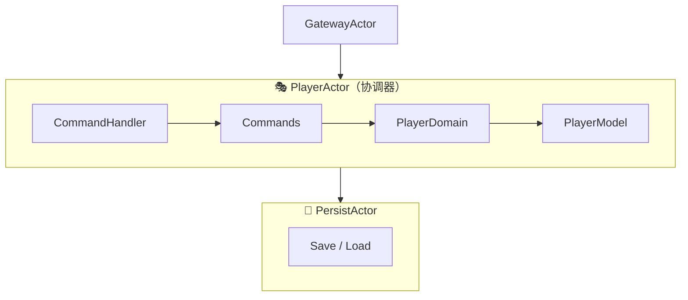

# 🧩 IdleMMO Server 架构重构说明（Phase 1.5）

> 本文档用于说明 IdleMMO 服务器在 Phase 1.5 阶段的架构重构计划与技术设计。  
> 目标是将原有 **PlayerActor 单体逻辑** 拆分为 **DDD（领域驱动）+ Command 模式** 架构，  
> 提升可扩展性、可测试性与团队协作效率。

---

## 🎯 重构目标

| 目标 | 说明 |
|------|------|
| 🧠 **职责分离** | 将 PlayerActor 的数据与业务逻辑彻底拆分 |
| ⚙️ **领域建模** | 引入 PlayerModel / PlayerDomain，形成 DDD 层次 |
| 🔧 **命令模式** | 使用 Command 接口统一处理客户端指令 |
| 🔄 **消息解耦** | 消息处理（Command）与逻辑执行（Domain）彻底分离 |
| 🧩 **Actor 精简** | PlayerActor 仅保留消息调度与生命周期管理 |

---

## 🧱 重构后层次结构



> 💡 PlayerActor 只作为消息协调者，不再直接执行业务逻辑。

---

## 🧩 模块划分

| 模块 | 职责 | 示例文件 |
|------|------|-----------|
| **PlayerModel** | 纯数据结构，存储玩家状态、经验、背包、装备等 | `player_model.go` |
| **PlayerDomain** | 封装业务逻辑（使用物品、修炼、装备） | `player_domain.go` |
| **CommandHandler** | 统一解析客户端消息并分派命令 | `command_handler.go` |
| **Commands** | 每个客户端操作对应一个 Command 实现 | `commands/use_item.go`、`commands/start_seq.go` |
| **PlayerActor** | 协调 Actor 生命周期与消息流转 | `player_actor.go` |

---

## ⚙️ Command 模式设计

```go
type Command interface {
    Execute(ctx actor.Context, p *PlayerActor) error
}
```

### 示例：启动修炼命令

```go
type StartSequenceCommand struct {
    SeqID string `json:"seq_id"`
}

func (c *StartSequenceCommand) Execute(ctx actor.Context, p *PlayerActor) error {
    return p.domain.StartSequence(p.model, c.SeqID)
}
```

### 命令注册与分发

```go
type CommandHandler struct {
    registry map[string]func([]byte) Command
}

func (h *CommandHandler) Register(name string, factory func([]byte) Command) {
    h.registry[name] = factory
}

func (h *CommandHandler) Handle(ctx actor.Context, p *PlayerActor, msg *MsgClientPayload) {
    var base struct{ Type string }
    json.Unmarshal(msg.Raw, &base)

    if factory, ok := h.registry[base.Type]; ok {
        cmd := factory(msg.Raw)
        cmd.Execute(ctx, p)
    } else {
        p.sendError(fmt.Errorf("unknown command: %s", base.Type))
    }
}
```

---

## 📚 领域层 (Domain) 设计

### 示例：使用物品逻辑

```go
func (d *PlayerDomain) UseItem(p *domain.PlayerModel, id string, count int64) error {
    if err := p.Inventory.RemoveItem(id, count); err != nil {
        return err
    }
    p.Exp += count * 10
    return nil
}
```

### 示例：修炼启动逻辑

```go
func (d *PlayerDomain) StartSequence(p *domain.PlayerModel, seqID string) error {
    // 启动 SequenceActor 或执行对应修炼逻辑
    p.CurrentSeqID = seqID
    p.LastActive = time.Now()
    return nil
}
```

---

## 🧩 PlayerModel 示例结构

```go
type PlayerModel struct {
    ID               string
    Exp              int64
    SeqLevels        map[string]int
    Inventory        *Inventory
    Equipment        *EquipmentLoadout
    ActiveSubProject string
    IsOnline         bool
    OfflineStart     time.Time
    OfflineLimit     time.Duration
    LastActive       time.Time
    CurrentSeqID     string
}
```

---

## 🔄 消息流改造前后对比

| 阶段 | 调用链 | 特点 |
|------|--------|------|
| **改造前** | WebSocket → PlayerActor → 内部逻辑 | Actor 过度膨胀、逻辑耦合 |
| **改造后** | WebSocket → PlayerActor → Command → Domain → Model | 职责清晰、可扩展、可测试 |

---

## 🧠 重构收益

| 维度 | 效果 |
|------|------|
| **可维护性** | 各模块职责单一，代码清晰 |
| **扩展性** | 新增功能只需添加命令和领域逻辑 |
| **可测试性** | Domain 与 Model 可单元测试 |
| **稳定性** | Actor 逻辑更轻，减少阻塞与死锁风险 |
| **性能** | 基本不变（结构变化为零开销） |

---

## 🚀 下一步规划

1. 完成 PlayerDomain 的基础功能实现（UseItem / StartSeq / EquipItem）。  
2. 将 CommandHandler 集成进 PlayerActor.Receive()。  
3. 为 Command 层增加自动注册机制。  
4. 编写单元测试：验证 PlayerDomain 的纯逻辑正确性。  
5. 最终清理旧逻辑并替换为统一 Command 分发。

---

## 📘 参考文件结构

```
internal/actors/player/
├── player_actor.go
├── player_domain.go
├── player_model.go
├── command_handler.go
└── commands/
    ├── start_seq.go
    ├── stop_seq.go
    ├── use_item.go
    └── equip_item.go
```

---

## ✨ 结语

> 此次重构的核心理念是让每一层只做它最擅长的事：  
> Actor 负责调度，Command 负责动作，Domain 负责规则，Model 负责状态。  
>  
> 当系统可以独立验证每一层的正确性时，  
> IdleMMO Server 才真正具备“可扩展性”和“可演化性”。
