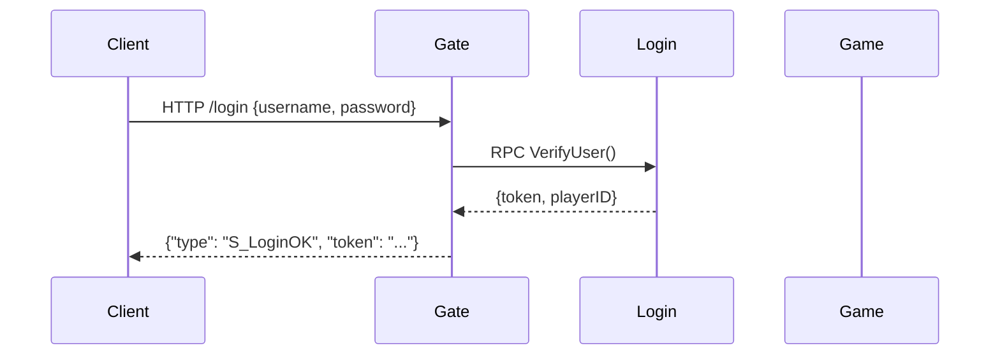
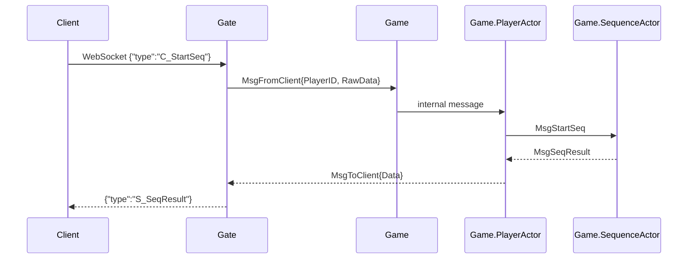
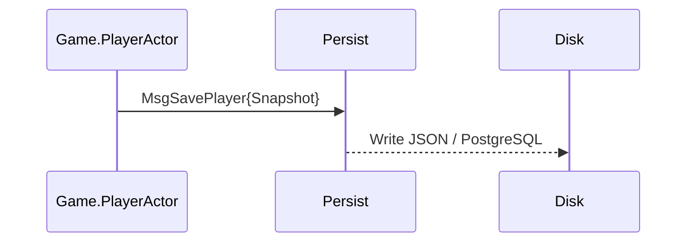

# 🧩 Modular Actor Project Design
> 分布式 Actor 架构下的模块化 IdleMMO 服务端设计

---

## 🎯 目标
通过 **Actor 模型 + 模块化系统架构**，实现：
- 可横向扩展的分布式系统；
- 模块间零共享内存、消息通信；
- 高内聚、低耦合、清晰目录；
- 支持未来集群部署与微服务演进。

---

## 🧱 工程结构

```
idlemmoserver/
├── login/                 # 登录服务模块
│   ├── go.mod
│   ├── main.go            # package main
│   └── internal/
│       └── login/         # 包层逻辑
│           ├── handler.go
│           ├── nats_handler.go
│           └── service.go
│
├── gate/                  # 网关服务模块
│   ├── go.mod
│   ├── main.go
│   └── internal/gate/
│       ├── actor.go
│       ├── connection.go
│       └── nats_handler.go
│
├── game/                  # 游戏逻辑服务模块
│   ├── go.mod
│   ├── main.go
│   └── internal/game/
│       ├── player_actor.go
│       ├── sequence_actor.go
│       ├── nats_handler.go
│       └── domain/
│           ├── player_model.go
│           └── inventory.go
│
├── persist/               # 持久化模块
│   ├── go.mod
│   ├── main.go
│   └── internal/persist/
│       ├── actor.go
│       ├── repository.go
│       └── nats_handler.go
│
├── common/                # 公共定义模块（独立 go.mod）
│   ├── go.mod
│   ├── messages.go
│   ├── types.go
│   ├── constants.go
│   └── subjects.go
│
└── go.work                # Go workspace 统一管理依赖

```

---

## 🧩 模块职责划分

| 模块 | 职责 |
|------|------|
| **common** | 跨模块共享结构（消息、类型、协议） |
| **login** | 负责用户登录、token 签发 |
| **gate** | WebSocket 接入、转发、心跳检测 |
| **game** | 游戏逻辑核心：玩家、背包、修炼、装备 |
| **persist** | 异步数据持久化，保存与加载玩家数据 |
| **cluster** | 模块间通信：Actor PID 注册、消息中转、远程调用 |
| **scripts** | 一键运行 / 部署脚本 |
| **docs** | 项目文档与规范说明 |

---

## 🔄 数据流与模块间通信

### 登录阶段


### 游戏通信阶段


### 持久化阶段


---

## ⚙️ 通信协议设计

| 通信方向 | 协议 | 技术选型 |
|-----------|--------|------------|
| Gate → Login | gRPC / HTTP | 用户验证 |
| Gate → Game | protoactor-go/remote | Actor PID 远程消息 |
| Game → Persist | protoactor-go/remote | 异步消息 |
| Game → Game（跨节点） | protoactor-go/cluster | 玩家交互 |
| Game → Client | WebSocket | JSON 消息流 |

---

## 🧠 模块独立运行逻辑

每个模块拥有独立的 ActorSystem：
```go
func main() {
    system := actor.NewActorSystem()
    props := actor.PropsFromProducer(NewGatewayActor)
    pid := system.Root.Spawn(props)
    system.Root.Send(pid, &MsgInit{})
}
```

通过 `cluster` 模块注册并发现其他节点：
```go
cluster.RegisterNode("game", "127.0.0.1:5001")
cluster.RegisterNode("persist", "127.0.0.1:5002")
```

---

## 🚀 启动方式

`scripts/run_all.sh`
```bash
#!/bin/bash
go run login/main.go &
go run gate/main.go &
go run game/main.go &
go run persist/main.go &
wait
```

---

## ✅ 优点总结

| 优点 | 说明 |
|------|------|
| 🚀 模块独立 | 每个模块可单独开发、部署、重启 |
| 🔄 消息通信 | 通过 protoactor remote 传递消息，零共享内存 |
| 🔒 安全可靠 | Actor 模型天然线程安全 |
| 🔧 易扩展 | 新模块只需注册进 cluster 即可 |
| 💾 可持久化 | 独立 Persist 服务处理数据 |
| 🌍 可分布式 | 轻松部署到多台机器或容器 |
| 🧠 高内聚低耦合 | 逻辑内聚、边界清晰、依赖倒置 |

---

## 🧭 总结

这套设计让 IdleMMO Server：
- 从「包结构」进化到「服务模块结构」；
- 从「并发安全」走向「分布式并发安全」；
- 从「单体 Actor」变为「Actor Cluster」。

> 💡 模块即服务，消息即接口，Actor 即系统。
